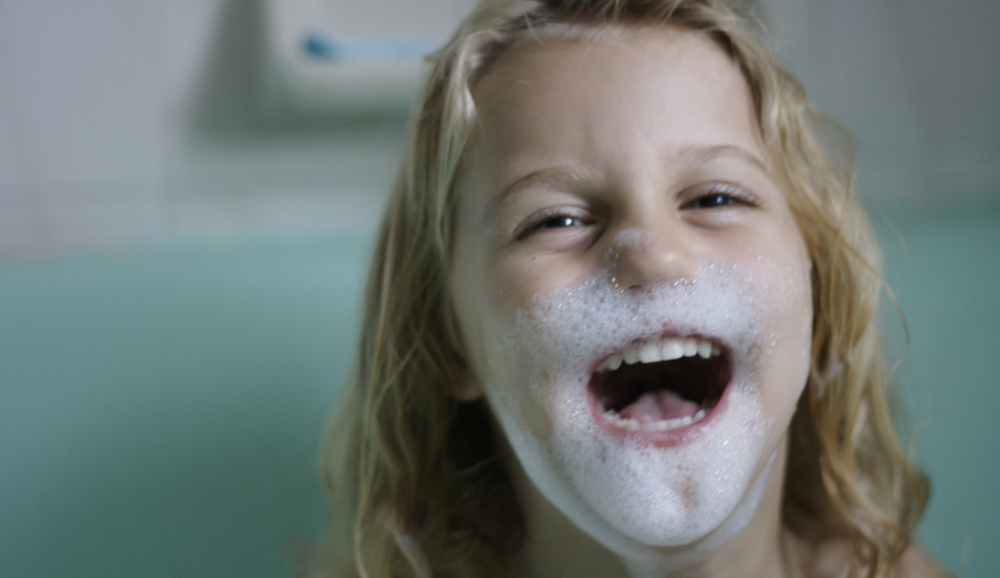

# Een bad nemen om te groeien
De korsten van je brood eten, op tijd gaan slapen… En de hik zou ook kunnen helpen. Maar waar kinderen ook goed van groeien, is een bad met proper water en zeep. De reden is niet ver te zoeken: met proper water worden kinderen minder snel ziek.

Volgens een groot wereldwijd onderzoek valt het echt wel op. Kinderen in landen met weinig toegang tot schoon water, zijn gemiddeld 0,5 tot 1 centimeter kleiner. Het verschil lijkt niet groot, maar het is vooral de achterliggende betekenis die belangrijk is.

Kleine kinderen in armere landen krijgen veel te maken met ziektes die makkelijk te voorkomen zijn. Als die kinderen regelmatig een goed bad zouden krijgen, zouden ze veel gezonder kunnen leven. En door minder ziek te zijn, zouden ze ook beter kunnen groeien.