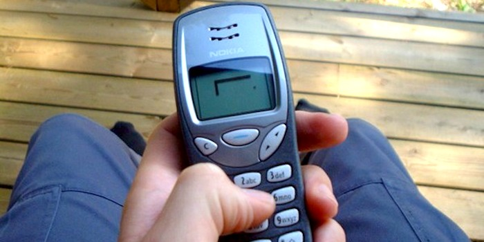

# Gemaakt om stuk te gaan
Je gsm, computer, tv, haardroger… Alles lijkt tegenwoordig sneller stuk te gaan. Vaak ook nog nét buiten de garantieperiode. Fijn. Wat als we nu eens niet paranoïde zijn? Wat als elektronica echt gemaakt is om sneller kapot te gaan? Volgens enkele recente onderzoeken zou dat wel eens kunnen kloppen…

Denk eens terug aan je allereerste gsm. Een stevige bak – Nokia misschien? – die je waarschijnlijk wel een jaar of vijf hebt gehad. En kijk nu eens naar je huidige gsm. Zou die vijf jaar meegaan? Als je je eerste gsm nu van de zolder zou halen, is de kans groot dat hij nog werkt wanneer je hem oplaadt. Meer zelfs: waarschijnlijk zal de batterij nog langer meegaan dan die van een nieuwe smartphone.

Ook andere apparaten lijken tegenwoordig een kortere levensduur te hebben. In 1985 ging een desktop computer bijvoorbeeld nog makkelijk 10 jaar mee; nu is dat gemiddeld nog 3,5 jaar. De technologie is erop vooruit gegaan, maar blijkbaar gaat de kwaliteit van elektronica toch serieus achteruit.

Volgens een onderzoek van Test-Aankoop zijn er twee grote oorzaken voor dit fenomeen. Ten eerste hebben ze aangetoond dat apparaten effectief brozer worden gemaakt door de fabrikanten. In een tv of haardroger bijvoorbeeld, worden gevoelige kabels vaker vlak bij een warmtebron gelegd, met als gevolg dat die kabels sneller zullen verslijten. Niet per sé duur om te herstellen, maar wel een ongemak – en de consument zal eerder een nieuw toestel kopen.

Maar de kortere levensduur heeft ook veel te maken met ons eigen koopgedrag. We willen tegenwoordig steeds meer – het meeste geheugen, het nieuwste toestel – en liefst voor zo weinig mogelijk geld. Geen wonder dus dat de kwaliteit erop achteruitgaat. Een gsm zal nu dus betere technologie hebben, meer opties en meer geheugen, maar hij zal ook niet zo lang meegaan. Voor de huidige consument niet zo erg: een jaar later is er toch al een nieuw model – met betere technologie, meer opties en meer geheugen.