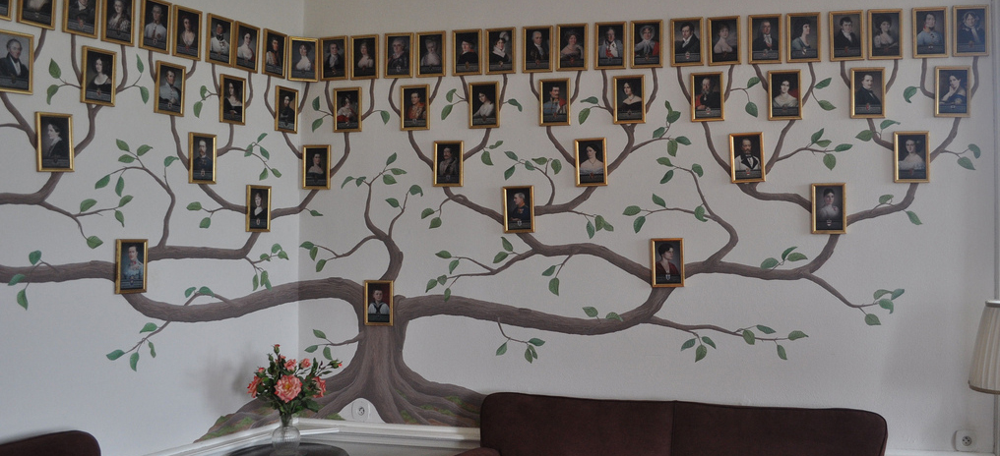

# Elke Europeaan is van koninklijke afkomst
Aan iedereen die dit leest: proficiat! Volgens historici en wiskundigen ben je **van koninklijke afkomst.** En je bent waarschijnlijk **nauwer verwant met je vrienden en kennissen** dan je zou denken.

Heb je je ooit al afgevraagd of je **stamboom ergens kruist** met die van je beste vriend - of misschien zelfs met die van je lief? Het antwoord is ja. Alle mensen die vandaag leven, hebben **een gemeenschappelijke voorouder.** Wiskundige Joseph Chang onderzocht het fenomeen binnen Europa en kwam tot verrassende conclusies.

Wanneer je je stamboom uittekent, **verdubbelen je voorouders per generatie.** Je hebt twee ouders, vier grootouders, acht overgrootouders enzovoort. Als je 100 generaties terug zou gaan, dan zou je uitkomen op 1,267,650,600,000,000,000,000,000,000,000 voorouders. **Onmogelijk,** want zoveel mensen hebben nooit geleefd.

De verklaring is natuurlijk dat één voorouder **niet exact één keer voorkomt** in je stamboom. Je over-over-over-over-overgrootmoeder langs één tak komt heel waarschijnlijk ook voor in een andere tak. En ook in de stamboom van andere mensen die je kent. Volgens de berekeningen van Joseph Chang hebben alle Europeanen die vandaag leven, **een gemeenschappelijke voorouder die 600 jaar geleden nog leefde!**

Changs berekeningen leveren nog verrassende cijfers op. 20 procent van iedereen die **1000 jaar geleden** leefde, heeft nu geen nakomelingen meer. Omdat zij of hun nageslacht op een gegeven moment geen kinderen meer kregen. Maar de overige **80 procent is eigenlijk een voorouder van élke Europeaan** die vandaag leeft.

Omdat onze stambomen zo vaak overlappen met elkaar, kan je met zekerheid zeggen dat je **verwant bent met iedereen die je kent.** En dat je **afstamt van bekende Europeanen** van eeuwen geleden, zoals koningen. Jawel, door al onze aderen stroomt koninklijk bloed!