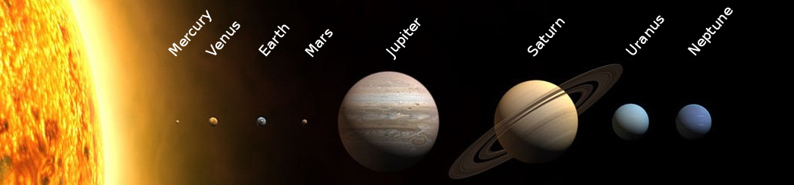

# Jupiter krimpt elk jaar 2 centimeter
Jupiter is de grootste planeet in ons zonnestelsel. **En ooit was de planeet zelfs nog groter.** Hij krimpt namelijk beetje bij beetje!

Jupiter is **een gasreus** en heeft dus geen vast oppervlak. Het afkoelen van het gasoppervlak, vooral bestaande uit waterstof en helium, zorgt ervoor dat **het Kelvin-Helmholtzmechanisme** optreedt.

Als de temperatuur van een gas daalt, **moet de verhouding druk en volume ook dalen.** Doordat het oppervlak afkoelt, daalt de totale temperatuur en daardoor ook de druk in de volledige planeet. De gasreus wordt dan eigenlijk samengeperst **om die drukverlaging te compenseren.**

Dankzij dit proces krimpt de planeet ongeveer 2 cm per jaar. Bij zijn ontstaan was Jupiter dubbel zo groot als nu!