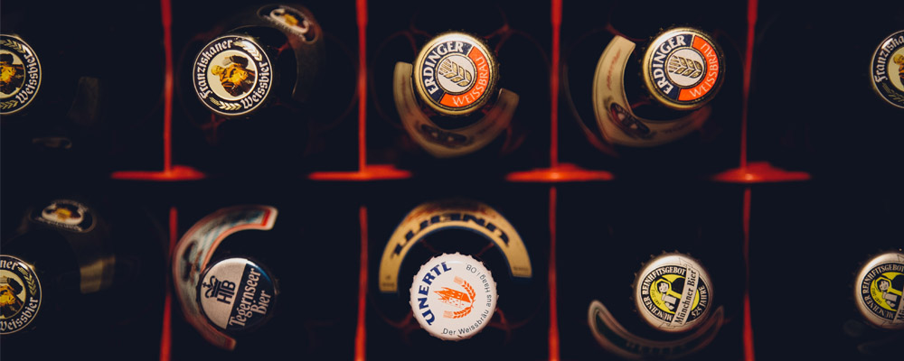

# Waarom je morgenvroeg misschien een kater hebt
Waarom kan de ene persoon dronken worden zonder problemen, en kan de andere de volgende dag niet uit z'n bed? Of misschien nog belangrijker: **waarom krijgen we een kater na te veel alcohol? En kunnen we dat voorkomen?**

Het waarom van een kater is eigenlijk vrij makkelijk. Na een avondje drinken word je weer nuchter doordat je lichaam de alcohol in je lijf afbreekt. **De ethanol wordt dan omgezet in methanol.** Later - gemiddeld 10 uur nadat je gedronken hebt - wordt die methanol weer afgebroken, en komen er stoffen als formaldehyde en methaanzuur vrij. Dat zegt je misschien niets, maar dat zijn eigenlijk **giftige stoffen**.

Als je dus 's avonds te veel alcohol drinkt, heb je de volgende ochtend **te veel van die stoffen** in je lichaam en **voel je je dus ziek: een kater!**

De oplossing? **Die is er niet echt...** Wie dus beweert hét middeltje gevonden te hebben, liegt! Natuurlijk kan het altijd helpen **de symptomen te behandelen.** Als je door een kater hoofdpijn hebt, kan die weggaan door een pilletje tegen de hoofdpijn te nemen.

Volgens veel wetenschappers is het wel belangrijk **veel suikers op te nemen**, omdat een teveel aan alcohol vaak zorgt voor een tekort aan suikers in je bloed. Door een uitgebreid ontbijt met een fruitsapje, kan je dus ook de symptomen van een kater verminderen. En goed hydrateren, natuurlijk!

Nog wel leuk om weten: uit verschillende onderzoeken blijkt dat **zo'n 22 procent van de mensen geen kater krijgt!** Of dat genetisch bepaald is, weten we voorlopig nog niet. Als je geluk hebt, dan heb je dus helemaal geen anti-kater-tips nodig!