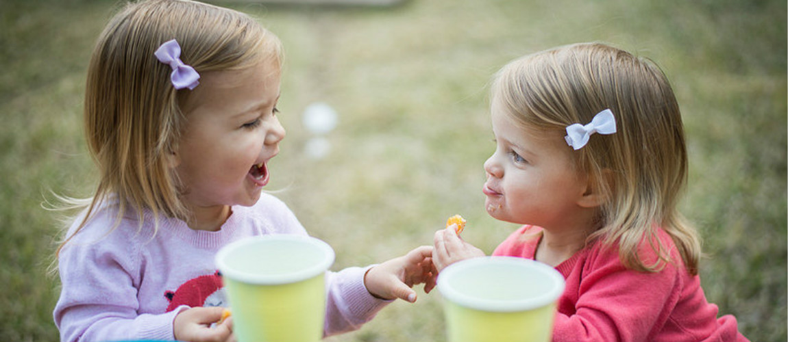
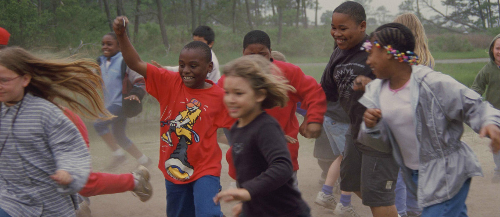

# Worden kinderen actief van suiker?
Kinderen worden hyperactief van suiker. Waar of niet? Alle ouders zijn ervan overtuigd dat ze wel degelijk een verschil zien bij hun kinderen, maar dat blijkt toch niet echt zo te zijn.

Er zijn de afgelopen jaren veel onderzoeken gedaan naar deze vraag. En de onderzoekers kwamen steeds op hetzelfde resultaat uit. De setup was eenvoudig: een groep kinderen werd uitgenodigd voor een feestje, na een paar uur mochten de ouders hen weer oppikken.

Daarbij kreeg de helft te horen dat hun kinderen snoep hadden gegeten en frisdrank hadden gedronken. De andere kinderen hadden alleen gezonde snacks voorgeschoteld gekregen, en zouden dus geen 'sugar rush' hebben.

En dat konden de ouders natuurlijk meteen zien. Hun kinderen liepen opgewonden rond, druk spelend met hun vriendjes en vriendinnetjes: 'het is duidelijk dat ze suiker hebben gekregen'. En bij de kinderen die gezond hadden gegeten: 'als je ze suiker had gegeven, dan waren ze nog veel drukker geweest!'

Twist van het verhaal: de kinderen hadden allemaal gezonde snacks gekregen - geen snoep, geen frisdrank, en dus ook geen _sugar rush_. Omdat elke ouder het fabeltje rond suiker kent, geloven ze dat ze het ook echt zien bij hun kinderen. Maar de waarheid is dat kinderen gewoon druk zijn - zeker wanneer ze met vriendjes en vriendinnetjes kunnen spelen.