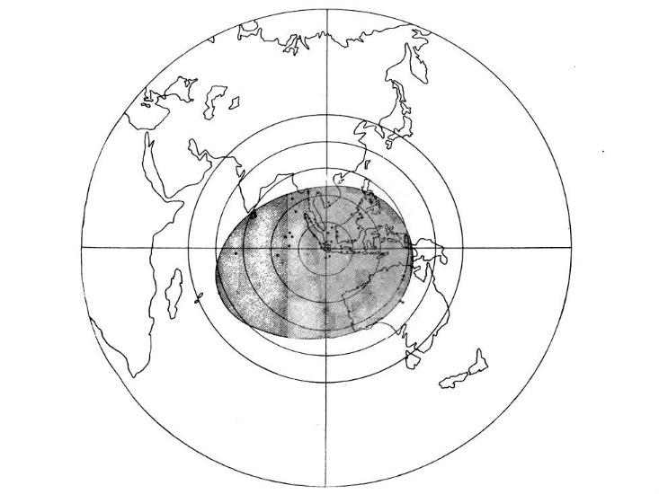

# Het luidste geluid ooit
De **vulkaan Krakatoa in Indonesië** maakte in 1883 **het luidste geluid ooit gemeten**, toen de vulkaan uitbarstte. Tot op zo'n **vijfduizend kilometer afstand** konden mensen de explosie horen.

De uitbarsting zorgde voor gigantisch veel rook, lava en een enorme tsunami, maar dus ook voor een overweldigende knal. De geluidsgolven reikten duizenden kilometers ver. In het toenmalige Batavia - _nu Jakarta, de hoofdstad van Indonesië_ - werd met een barometer het verschil in luchtdruk gemeten.

Door het niveau van het kwik dat toen genoteerd werd, weten we nu dat de vulkaan ontplofte met een kracht van **172 decibel.** Ter vergelijking: **de menselijke pijngrens ligt ongeveer op 130 decibel**, en een straaljager produceert zo'n 150 decibel.

Hoe verder het geluid reikte, hoe stiller het natuurlijk werd. De laatste mensen die het hoorden, duizenden kilometers verder, gaven aan dat het **klonk als geweerschoten uit de verte.** Hoewel het menselijk oor het geluid daarna niet meer oppikte, golfde het toch **nog dagenlang rond de aarde.**

Zes uur na de explosie zagen wetenschappers een piek in barometers in Calcutta, India. Na acht uur konden de barometers in Sydney en Melbourne de beweging voelen, na twaalf uur ook in Rome en Parijs en na achttien uur in New York en Washington D.C.

Via die pieken in barometers konden de wetenschappers van die tijd dus perfect **de beweging van de geluidsgolven rond de aarde volgen.** De uitbarsting van de vulkaan Krakatoa zinderde nog **vijf dagen** na. Ongeveer om de 34 uur werd op tientallen plaatsen ter wereld een golf geregistreerd - dat is hoe lang het ongeveer duurt voor geluid de aarde rondgaat.

Hoewel het geluid van de explosie dus allang niet meer te horen was, bleven de geluidsgolven wel in beweging. Wie zich nu afvraagt hoe zoiets eruit ziet en vooral hoe het klinkt: onderstaande video _(van een andere vulkaanuitbarsting, uiteraard)_ geeft het effect heel mooi weer.

<iframe width="100%" height="315" src="https://www.youtube.com/embed/BUREX8aFbMs" frameborder="0" allowfullscreen></iframe>