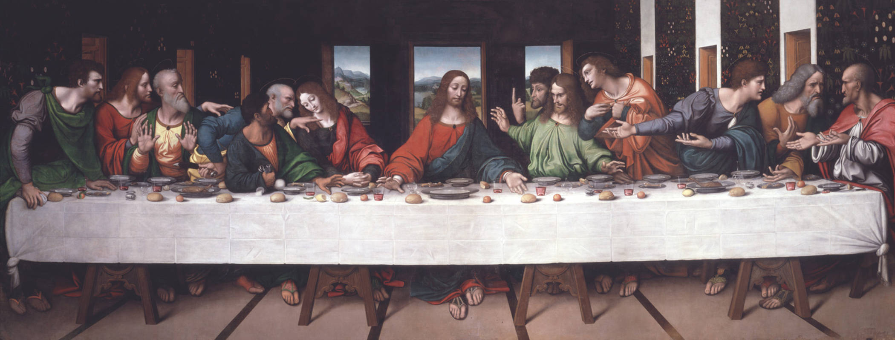

# Rituelen maken ons eten beter
Kaarsjes uitblazen, de bruidstaart aansnijden, of bidden – volgens wetenschappelijk onderzoek smaakt ons eten beter als er een ritueel aan voorafgaat. Je ogen focussen zich al op het eten, maar je zit nog in spanning af te wachten… En wanneer je het dan eindelijk krijgt, lijkt het veel lekkerder te zijn.

Het onderzoek zelf was natuurlijk ook smakelijk: proefpersonen kregen elk een reep chocola en mochten deze volledig opeten. De ene helft mocht dat direct doen, maar de andere helft kreeg instructies.

Ze moesten de reep eerst in een aantal verschillende stukjes breken – zo waren ze volledig gefocust op hun eten, voor ze het mochten opeten. Volgens de onderzoekers waardeerden deze proefpersonen hun dessertje veel meer dan de eerste helft.

Dus de volgende keer dat je aan tafel gaat, is het geen slecht idee om eerst een klein ritueel te doen. De aanblik van dat heerlijke eten op je bord werkt dan al op je smaakpapillen!