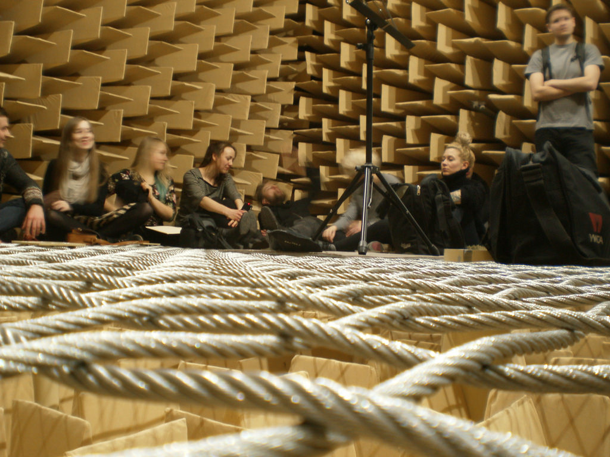

# De stilste kamer ter wereld
Een anechoïsch kamer wordt het genoemd, wat zoveel betekent als echovrij. De muren, de vloer en het plafond absorberen elk geluid in de kamer en laten ook geen geluid van buitenaf binnen. Het is zo stil in deze kamer, dat het geluidsniveau -9 decibel is. De stilste ruimte ter wereld.

Dat alles heeft tot gevolg dat jij zelf de enige bron van geluid zou zijn wanneer je in deze kamer zou staan. Meer zelfs: je oren gaan zich op zo'n manier aanpassen aan de stilte, dat je jezelf en je eigen lichaam extreem luid hoort. Je kan je hart horen kloppen, de lucht in je longen horen bewegen en je maag en darmen horen werken.

In de kamer staan is trouwens niet zo'n goed idee. Al na enkele minuten zal je evenwichtsgevoel verstoord worden, omdat je oren absoluut geen enkel geluid van de omgeving opvangen. We merken het zelf niet, maar ons evenwichtsorgaan heeft echt nood aan die omgevingsgeluiden. Daarom zal je al heel snel duizelig worden en je gevoel voor richting verliezen. Best om er even een stoel bij te nemen, dus.

Dit soort ruimtes wordt vaak gebruikt om astronauten voor te bereiden op de stilte van de ruimte, maar voor gewone mensen is het niet echt aangeraden. Geen gewone bezoeker heeft het er al langer volgehouden dan drie kwartier - je wordt hier gewoon gek van de stilte. 