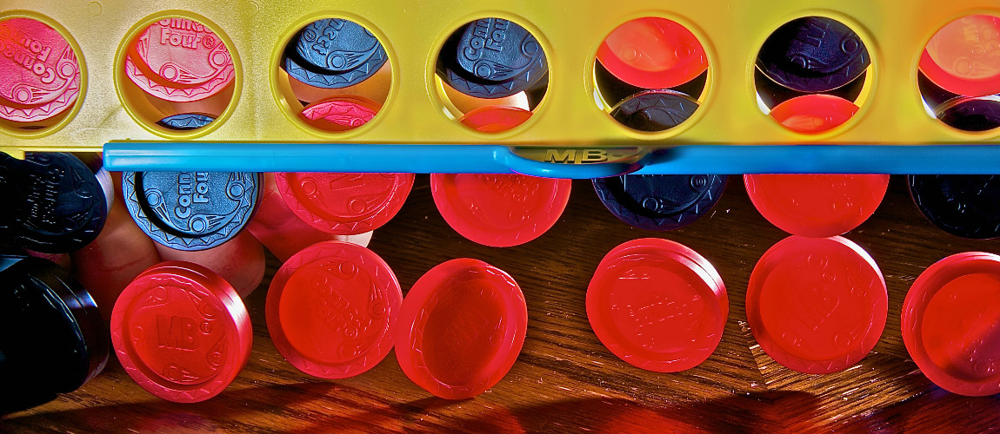

# Zo win je 'vier op een rij'
Het zal je niet verbazen, maar de wetenschap heeft weer eens een spel volledig opgelost. Er bestaat namelijk een wiskundige manier om ‘vier op een rij’ altijd te winnen. Enige voorwaarde: je moet het spel beginnen!

De manier om te winnen is simpel en heeft alles te maken met je eerste zet. Wanneer je je eerste schijfje in de middelste kolom laat vallen – en daarna geen fouten maakt – zal je sowieso winnen. Als je kiest voor één van de twee kolommen ernaast, dus links van het midden en rechts van het midden, zal het gelijkspel worden. Wanneer je het schijfje in één van de andere kolommen laat vallen, dus de twee meest linkse en de twee meest rechtse, dan zal je tegenstander winnen.

Het spel zal uitgespeeld zijn wanneer het voorlaatste schijfje valt. Dan heb je dus sowieso vier op een rij. De theorie gaat natuurlijk alleen op als beide spelers perfect spelen: als je ergens een fout maakt, kan je tegenstander al eerder een kans hebben op vier op een rij.

Om het allemaal wat duidelijker te maken, kan je hieronder een filmpje zien van ‘het ideale spelletje ‘vier op een rij’’. Vanaf 3:17 begint het spelletje, en na de vierde minuut zie je de uitkomst, waarbij de beginner natuurlijk wint.

<iframe width="100%" src="https://www.youtube.com/embed/yDWPi1pZ0Po" frameborder="0" allowfullscreen></iframe>

Bonusfeitje: er zijn 1 904 587 136 600 verschillende manieren om een spelletje ‘vier op een rij’ te winnen!